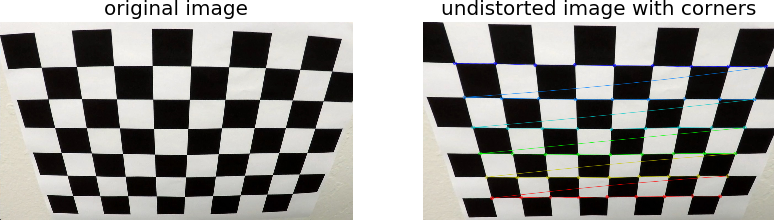
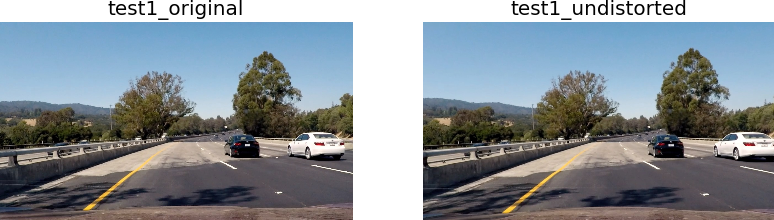
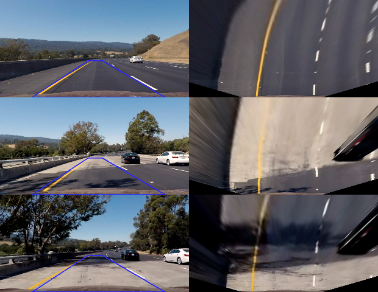
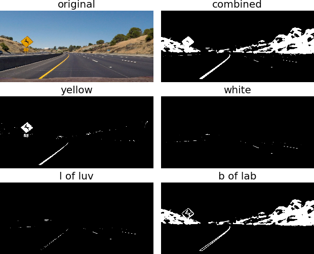
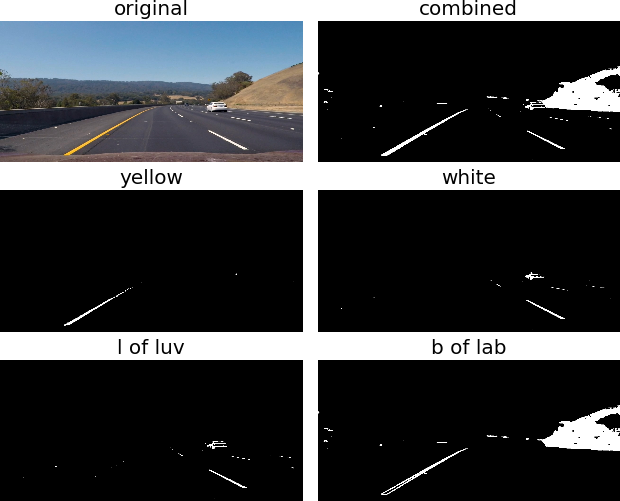
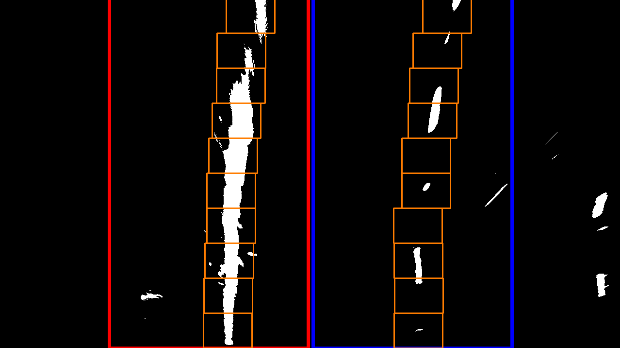
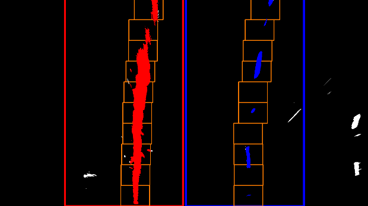

# CarND-Advanced-Lane-Finding

_**Nan-Tsou Liu**_ 2017-02-13

## Abstract

### Intrdouction

_**Advanced Lane Finding**_ is one of _**Udacity**_ **Self-Driving Car Engineer Nanodegree**. The task is to correctly detect the lane lines on the road and to draw the overlay on it. The resource of the images is the video provided by _**Udacity**_. The road are recoded by a camera set to the front of a car. Besides, the iamges of chessboard and 6 images for testing are also provided.

--
### Approach

As the approach of this project, I built the models cotains following methodologies, `camera calibration`, `perspective transform`, `Color thresholding` and `polynomial fitting`. The image of the approach is shown below.


Fist of all, `camera calibration` was carried out with the given chessboard images. I defined the source (`src`) area which contains the lane lines I wanted to found by the models and the destination (`dst`) which is used to `perspective transform`. As what instruction suggested, I warpped the images into bird's-eye view. 

For the third step, I applied `Color thresholding` only to extract **yellow** and **white** color. After lots of trial and error, I eventually used **L** channel of **LUV**, **b** channel of **Lab**, **yellow** area of **HVS** and **white** area of **HLS**. I did not use `Sobel thresholding` because I satisfied the results of `Color thresholding`. Hitsogram was performed to find the positions of the lane lins. Rather than using the half of image as the base, I performed histogram to find the lane lines in each window. After the lane lines are found as the points, I fitted the points with polynomail. And then I calculated the radius of curvature and the position offset with the fitted polynomail functions. 

As the final results, I drew the overlay made by fuond lane lines and put the information of the radius of curvature and position offset on the images.

### Result

[](https://youtu.be/iCOmGSDvGCc)

click the image for **youtube** videos


## Camera Calibration (`calibrator.py`)

In this step, I followed what the instruction taught to build my own `calibrator`. `findChessboardCorners`, `calibrateCamera` and `undistort` of _**CV2**_ were mainly used to build the model. `findChessboardCorners` is used to find the corners of the given images of chessboard after the images were grayscaled. And then `calibrateCamera` calculated the camera matrix and distortion coefficients with the corners. In order to resue the calibrated results, I implemented the mehtods to export and loading the results.

As the results shown below, I draw the found corners and showed the undistorted chessboard image to show the difference between distorted image and undistorted image. And then I inputted the testing image given by _**Udacity**_ to check my calibrator.





--

### Perspective Transform (`ptransformer.py`)

`getPerspectiveTransform` was firstly used to calcuate `transform matrix M` with defined source, `src` the area to be transformed from, and destination, `dst` the area that we expect how `src` to be transformed. As the suggestion given by the instruction, it is good option that transform `src` into bird's-eye view as `dst`. Besides, I noticed that how `src` and `dst` are defined would influence on the final result, I eventually defined `src` and `dst` as follows:

|src|dst|
|---|---|
|595, 450|450, 0|
|690, 450|830, 0|
|1115, 720|830, 720|
|216, 720|450, 720|

After `transform matrix M` was obtained, `warpPerspective` is used to transform the image into bird's-eye view. And the follows are the example that how perspective transform changes the images.

And in the final step, we have to inverse the transformation for bird's-eye view into its original view. The approach is quite simple that set the `dst` as the **new** `src` and the `src` as the new `dst`. Input new `src` and new `dst` to `getPerspectiveTransform` again. Then we can get a **new** `transform matrix M` as the `inverse transform matrix inv-M`. The results of inversed transform would be shown in very end of this report.



--

### Color Mask (`masker.py`)

At the beginning, I followed the instruction to use **S** channel of **HSV** as `Color thresholding` and **CV2.COLOR_RBG2GRAY** for `Sobel thresholding` to extract the lane lines. The results were good but the overlay is not stable along the video. It would be shifted out of the lane lines at some part, especially for the turing parts.

And therefore I began to investigate **Color models** like **HLS**, **LUV**, **Lab** and so on. Besides, I also noticed that some people using **HSV** or **HLS** to extract **yellow** and **white** parts rather than using a channel of a certain color model. So, I was also trying to extract **yellow** and **white** parts in the same way. Eventually, I decided to use **L** channel of **LUV** to extract both **yellow** and **white** part. And the results of that is not so clear, especially for **white**, so that I also used **b** channel of **Lab** to extract white parts. Besides, in order to ensure that **yellow** and **white** parts can be extracted well, I also applied **HVS** to extract **yellow** parts and **HLS** to extract **white** parts.

I followed the way taught by the instruction to apply thresholding, `binary[(channel >= thresh_min) & (channel <= thresh_max)] = 1`, so that output of applying thresholding on single channel is already in binary format. On the other hand, I call **CV2.inRange** to extract **yellow** and **white** parts from **HSV** and **HLS**. Although the dimension is changed from 3 dimension into 2 dimension, the value of reuslt is 255 rather than 1. So, the postprocess a little bit like normalization is required to make them in binary format.

After all the masks were built with binary format, I combined all these masks as the final output of color mask. And there is figure set to show the result of each mask and final combined mask.

#### Result 1



#### Result 2



--

### Lane Finding (`lanefinder.py: histogram_detection`)

I carried out this methodology by following the instruction. The difference from the way taugh by the instruction is that I took the histogram of each slide rather than taking the histogram of half of the image. But I also implemented a check that using the mean value of the previous slide if there are over 50 points found in the previous slide. By doing this, I can use smaller width of the searching window, the area I check whether there are lane lines. It somehow can reduce the time consuming during lane finding as shown in the code below.

```python
last_base = None
for i in range(steps):
    # define the range in y direction for searching
    end = target_img.shape[0] - (i * px_per_step)
    start = end - px_per_step
    # set last_base to current base if there are more 50 points found in previous image
    if last_base is None:
        # create histogram
        histogram = np.sum(target_img[start:end, :], axis=0)
        # add search_area[0], image offset in x direction, 
        # to ensure the positions of points are correct.
        base = np.argmax(histogram) + search_area[0]
    else:
        base = last_base
    
    # get the indices in the searching area based on "base" and "margin"
    good_inds = self.__get_good_inds(base, margin, start, end)
    # get points in both x and y directions
    cur_x, cur_y = self.nonzerox[good_inds], self.nonzeroy[good_inds]
    # append x and y if there are points found gotten by good indices
    if np.sum(cur_x):
        x = np.append(x, cur_x.tolist())
        y = np.append(y, cur_y.tolist())
    # store base if there are more 50 points found, otherwise set Noen to it
    if np.sum(cur_x) > 50:
        last_base = np.int(np.mean(cur_x))
    else:
        last_base = None
```

#### Searching Windows



Besides, I added the function to remove the outlier, the points out of `95%` of total points, because I took the histogram of each slide. So that there is the chance that the `base`, center point of the searching window, locates at noisy if there is no lane in this slide.



--

### Fit Polynomial (`line.py: update`)

--

### Radius of Curvature (`line.py: curvature`) and Position in Lane (`lanefinder.py: process`)

--

### Drawing Result (`lanefinder.py: __put_text, __draw_overlay`)

--

## Reflection
